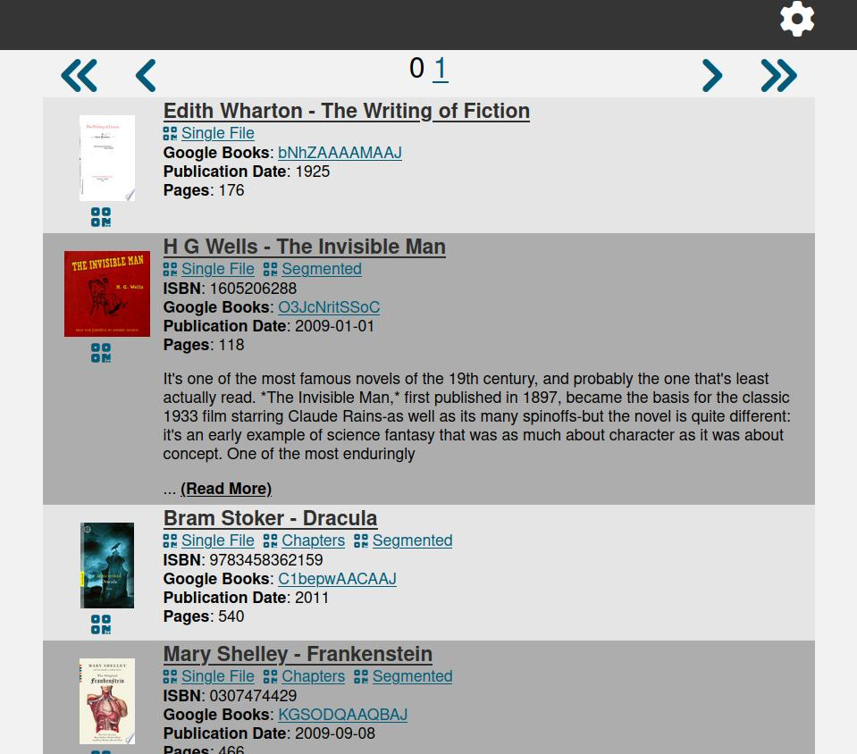
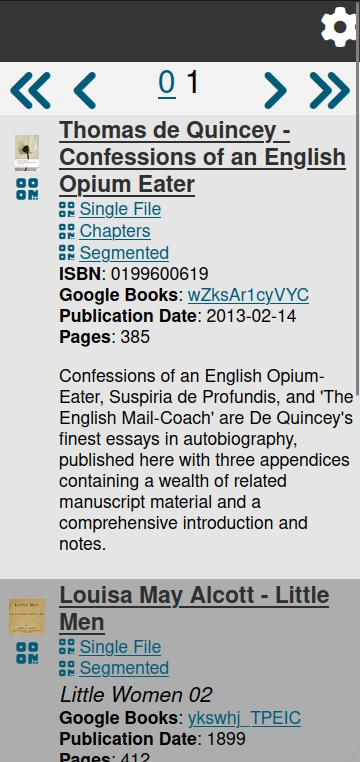
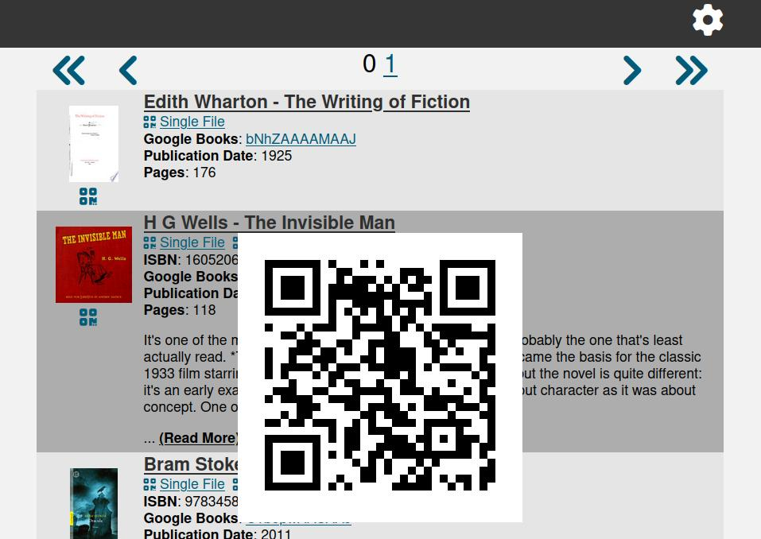
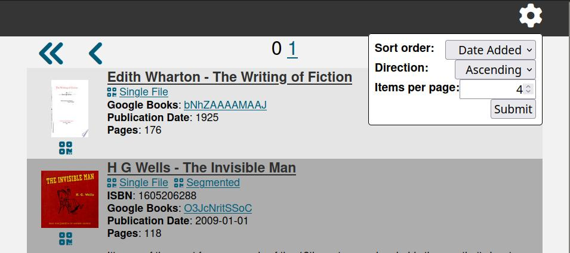

``audio-feeder`` is a Flask-based web-app that hosts your audiobooks (or other audio content) as RSS feeds compatible with podcatchers.

Features
========

The main interface lists all your audiobooks once the database is updated (either by using ``audio-feeder update`` or by visiting the ``/update`` url. The default interface should also work well on mobile:

Rendered feeds
**************
For each entry, ``audio-feeder`` can also generate "rendered" feeds, depending on what metadata is available:

- Single file: This feed consists of a single file; if the original directory contains multiple files, they will be merged together using ``ffmpeg``. If chapter information is not available in the original files, each file will be considered a separate "chapter".

- Chapters: This feed has one file per chapter; it is only available if explicit chapter metadata is available in the file (e.g. in an ``m4b`` file, or using Overdrive MediaMarkers).

- Segmented: This is a feed that splits up and recombines files in such a way as to create files that are ~1 hour long (preferring longer files to shorter files). Files will only be split up along chapter boundaries, but they can be combined from files without chapter information. This mode is available if the original entry has more than one file, or if it has chapter information (or both).

QR Codes
********

Each feed has an associated QR code, so that you can easily browse the list from a computer, but scan the individual feeds from your phone. In the default front-end, QR codes are displayed via modal pop-ups:

Display options
***************

The user can customize things like the sort order and the number of entries per page:

Installation and use
====================

Probably the easiest way to deploy this is via docker. For your convenience, I have created `a repository with a docker-compose configuration <https://github.com/pganssle/audio_feeder_docker>`_. It uses ``nginx`` to serve static media files, and ``gunicorn`` to deploy the application.

If you want to test it out locally, you can use ``tox -e start_server`` to run a test server. This will create a temporary server directory at ``/tmp/audio_feeder_server``, and you can play around with, and you can mount your audiobook directory at ``/tmp/audio_feeder_server/static/media`` to have it work on your own audiobooks (bind mount, symlink or hard link should work just fine).

In a ``virtualenv`` with ``audio-feeder`` installed, you can run ``audio-feeder --help`` to see the various command line tools bundled with the application.

Note
=====

While the state of this is getting much closer to something production-ready, I am emphatically *not* a front-end developer, and I don't have extremely high confidence in the security of this project. Use at your own risk (and if you do come up with some security and/or usability improvements, please do send a PR).

This is only tested on Linux, but it may also work on other platforms.

Dependencies
============

In addition to the python dependencies specified in ``pyproject.toml``, this project also requires installing ``ffmpeg`` with at least the ``aac`` codec, and the tests also require the ``libmp3lame`` codec.

License
=======
All images and documentation contained herein are licensed under `CC-0 <https://creativecommons.org/publicdomain/zero/1.0/>`_.

The code is released under the `Apache 2.0 <https://www.apache.org/licenses/LICENSE-2.0>`_ license.

Contributing
============
Pull requests and issues are more than welcome. Please be aware that your contributions will be released under the licenses stated above. If you are not comfortable with that, please do not make a pull request.
